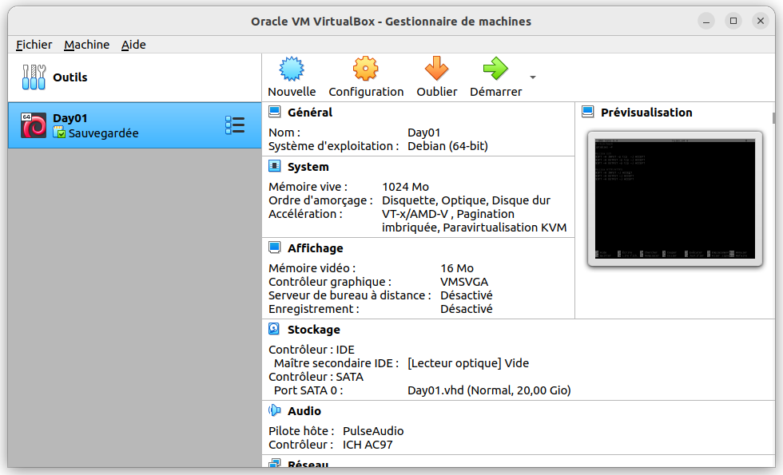
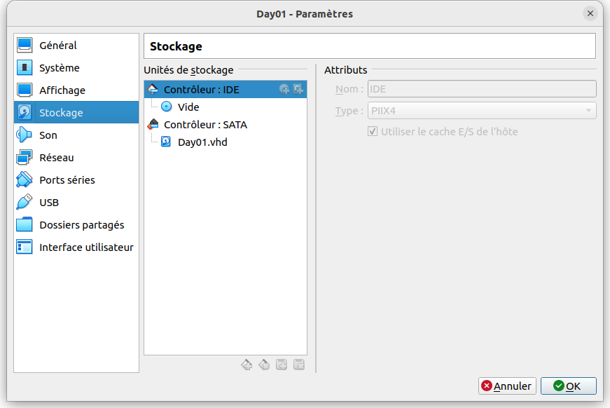
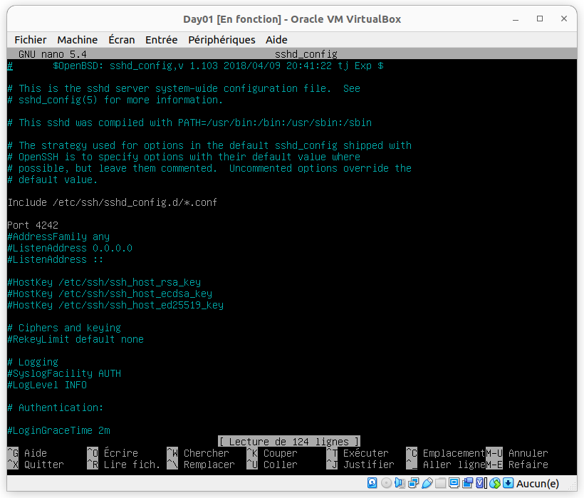
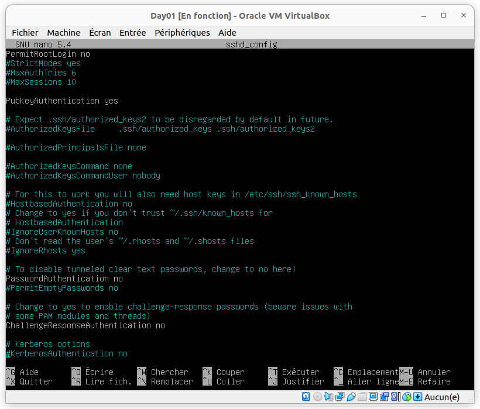
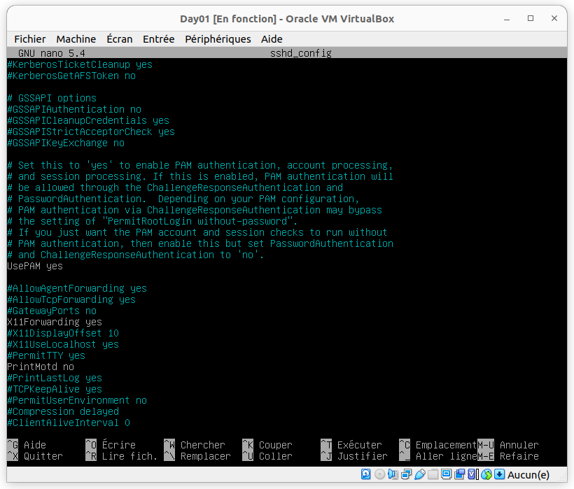
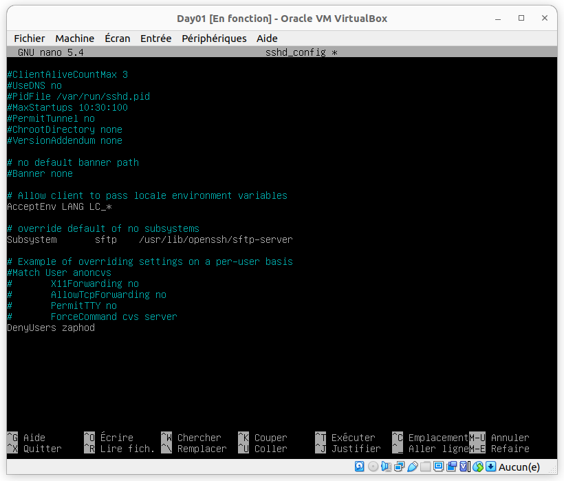
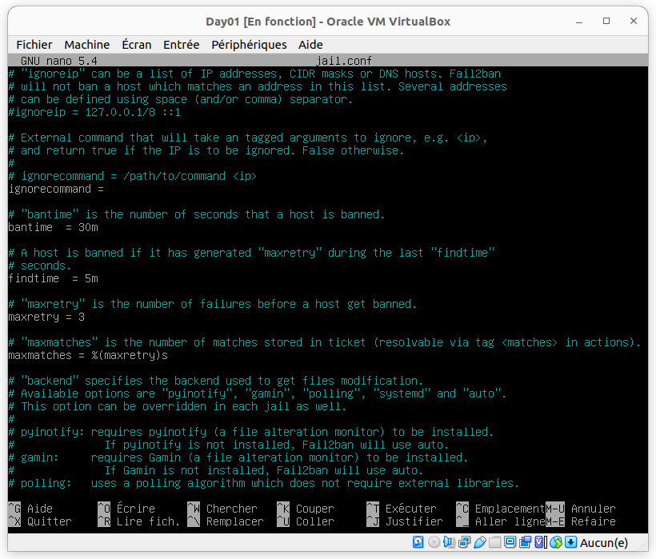
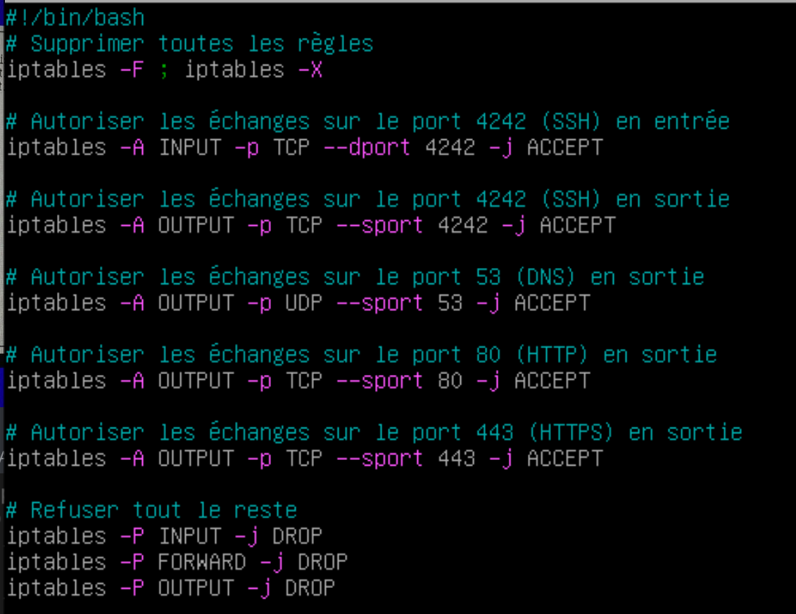

# Task 01
<b>Créer une nouvelle machine Linux/debian</b> 

<b>se rendre dans stockage</b> 

<b>Dans controlleur IDE ajouter un nouveau disque et choisir l'iso <a href="https://cdimage.debian.org/debian-cd/current/amd64/iso-cd/debian-11.5.0-amd64-netinst.iso"> télécharger</a></b> 
<b>suivre les étapes et choisir langue anglais</b> 
<b>se connecter avec root pour éviter les sudo</b> 

# Task 02

`adduser -u 4242 marvin` 
<b>remplir le QCM</b> 

# Task 03

`addgroup -gid 42400 H2G2 --force_badname` 
`usermod -gid 42400 marvin` 
`adduser -uid 4200 -gid 42400 zaphod` 
<b>remplir le qcm</b>
`cd home` 
`mkdir HeartOfGold` 
`chmod 775 HeartOfGold` 
`chgrp employees HeartOfGold` 

# Task 04

`cd etc/ssh` 
`nano sshd_config` 
<h2>config :</h2>

# Task 05

<b>Ajouter <u>DenyUser</u> zaphod dans</b> `sshd_config`

# Task 06

`apt_get install fail2ban` 
`cd ..` 
`cd fail2ban` 
`nano jail.conf` 

<h2>config :</h2>

# Task 07

`nano /etc/iptables/rules.v4` 

écrire à l'intérieur ce qu'il y a dans le screen puis donner les droits :  

`chmod +x /etc/iptables/rules.v4` 
`nano /etc/rc.local` 

écrire le script suivant :  
`#!/bin/bash` 
`./etc/iptables/rules.v4` 

puis lui donner les droits :  
`chmod +x rc.local` 

Petit conseil, supprimez les règles imposées sinon vous pourrez pas utiliser l'autograder :  

`iptables -F ; iptables -X`
